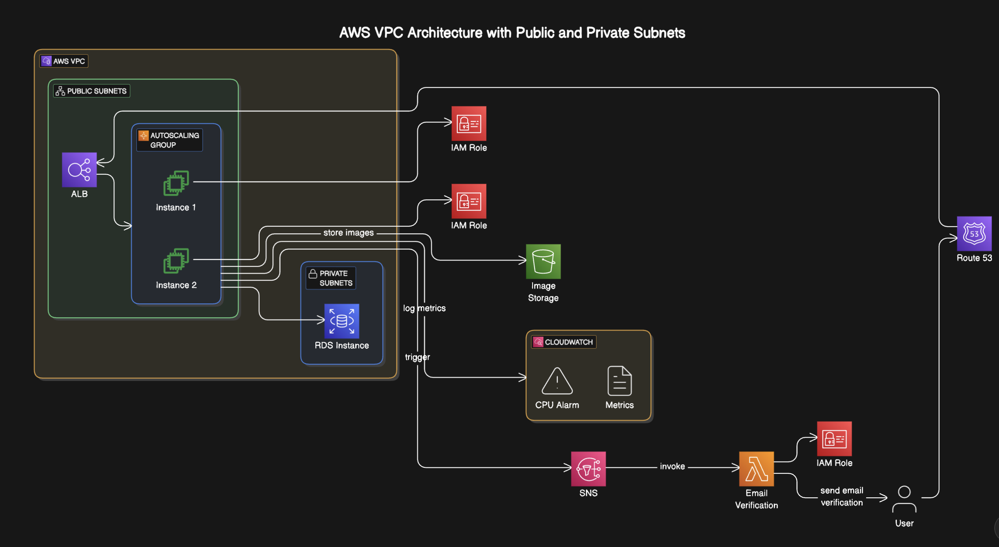

# tf-aws-infra

This project automates the deployment of a User Management REST API application on AWS using Terraform. It leverages AWS services such as EC2, RDS, S3, and Route 53, and includes the implementation of basic authentication, infrastructure-as-code, and automated CI/CD workflows.

## Architecture Overview

The system is designed to use both public and private subnets within a VPC. Below is an overview of the architecture:



- **Public Subnets**:
  - Two EC2 instances for running the user management API.
  - Autoscaling group for load balancing and scaling based on traffic.
  - Load Balancer (ALB) to distribute incoming traffic across instances.
  
- **Private Subnets**:
  - An RDS PostgreSQL database for storing user data and profiles.

- **Other Resources**:
  - S3 for scalable storage of profile pictures.
  - Secrets Manager for managing sensitive data like passwords.
  - KMS for encrypting sensitive data.
  - CloudWatch for monitoring CPU metrics and setting up alarms.
  - SNS for notifications.
  - Route 53 for DNS management, handling domains and subdomains.
  
## Features

- **AWS Infrastructure**: 
  - VPC with public and private subnets
  - EC2 instances for hosting the application
  - Load Balancer for traffic distribution
  - RDS PostgreSQL for database management
  - S3 storage for profile images
  - Route 53 for DNS management
  
- **Security**: 
  - Encryption of sensitive data using KMS keys
  - Password hashing and management using Secrets Manager
  
- **Automation**:
  - CI/CD pipeline for automated deployment
  - Packer for creating custom AMIs
  - Terraform for infrastructure-as-code
  
## Prerequisites

- Terraform installed
- AWS CLI configured with appropriate credentials
- Packer installed (for creating AMIs)

## Setup

1. Clone this repository to your local machine.
   ```bash
   git clone <git@github.com:dumbresi/terraform-aws-infra.git>
